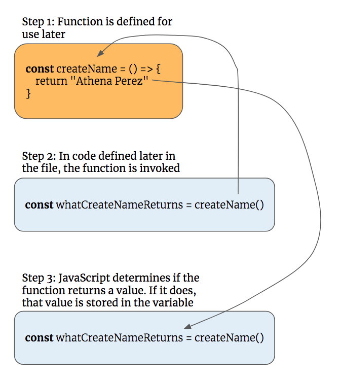

# Functions Workout

This chapter is for students who still feel they need to work on the mechanics and syntax of functions.

## To Return or not to Return

This function returns a value. Notice the `return` statement within the scope of the function. This **defines** the function, it does not invoke it. Consider it _logic to be executed when I need it_.

```js
const createName = () => {
    return "Athena Perez"
}
```

After the function is defined, you can invoke it. You do that _after_ the function's definition. Also, since it returns a value, you can store that value in a variable.

```js
/*
    Copy this code into the Chrome dev tools, or create
    a new Quokka workspace if you have installed that
    extension for Visual Studio Code.
*/
const createName = () => {
    return "Athena Perez"
}

// Function not invoked yet. Doing other things now.
const isStudent = true

// Function still not invoked.
if (isStudent) {
    console.log("This is a student")
}

/*
    Now you invoke the function and store its return
    value. You can name the variable anything that makes
    sense to you, and likely to make sense to another
    developer.
*/
const variableToStoreReturnValue = createName()

// ..or
const whatCreateNameReturns = createName()

// ..this is also valid, but not recommended
const elephantFart = createName()
```

If you then use `console.log()` to display the current value of any of those variables, the same thing will get displayed for each, since the `createName()` function returns the exact same value every time.

```js
/*
    Copy this code into the Chrome dev tools, or create
    a new Quokka workspace if you have installed that
    extension for Visual Studio Code.
*/

console.log(variableToStoreReturnValue)

console.log(whatCreateNameReturns)

console.log(elephantFart)
```

##### Output

```
Athena Perez
Athena Perez
Athena Perez
```

### Visual Flow



### No Returns or Exchanges

Now try it with the `return` statement removed from the function body.

```js
const createName = () => {
    "Athena Perez"
}

const variableToStoreReturnValue = createName()
const whatCreateNameReturns = createName()
const elephantFart = createName()

console.log(variableToStoreReturnValue)
console.log(whatCreateNameReturns)
console.log(elephantFart)
```

What is the output? It's `undefined`. The reason is because the function did not return a value, so all three variables never get a value assigned to them, even though the right side of the expression (the part after the equals sign) invokes a function.

## Practice: You are the Teacher

You are going to write a small program, using a couple of functions, that will output whether a concept you are teaching your students was understood or not. While in your classroom, you will be talking about a concept to a group of students. Afterwards, you will determine if your students understood the concept and the program will output the result.

The first step is to decompose this problem into smaller chunks. Consider what needs to happen in this process.

1. Decide on a topic to teach
1. Deliver a lesson
1. Determine if students understood
1. Display message about each students' understanding

Now that the problem is decomposed into smaller parts, you can write a function for each step.

```js
// Returns true or false
const didStudentsUnderstand = () => {
    return
}

// A simple fact about the subject of the day, such as
//   "The human brain contains 86 billion neurons"
const lessonPlan = () => {
    return
}

// Examples are biology, algebra, or english lit
const topicOfTheDay = () => {
    return
}

const displayUnderstanding = () => {
    const students = ["Denise", "Timothy", "Aaron", "Jacqueline", "Blake"]

    /*
      This function needs to invoke the `didStudentsUnderstand`
      function to determine if student understood
    */
    const understood = didStudentsUnderstand()

        for (let i = 0; i < 5; i++) {
            // Output "Denise did understand the lesson" or
            // "Denise did not understand the lesson"
            if () {
               console.log()
            } else {
               console.log()
            }
        }
    }
}
```

At this point, you have defined the logic for each of the smaller logical steps to solve the larger problem. Now you need to recompose them in the right order. Invoke the functions in the correct order. Once you have the order correct, start changing the values that each function returns and see how it affects the outcome of the program.
